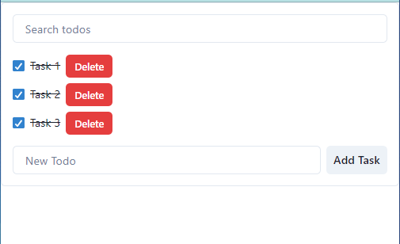

# TodoList Project

This is a simple TodoList project built with React.js and Chakra UI.

## Features

- Add new tasks
- Delete tasks
- Mark tasks as completed
- Filter tasks by title

## Screenshot

## Folder Structure

├── public
│ └── index.html
├── src
│ ├── components
│ │ ├── TodoList.js
│ │ └── ...other components
│ ├── TodoListContext.js
│ └── App.js
├── package.json
└── README.md

## Dependencies

- [React.js](https://reactjs.org/)
- [Chakra UI](https://chakra-ui.com/)

